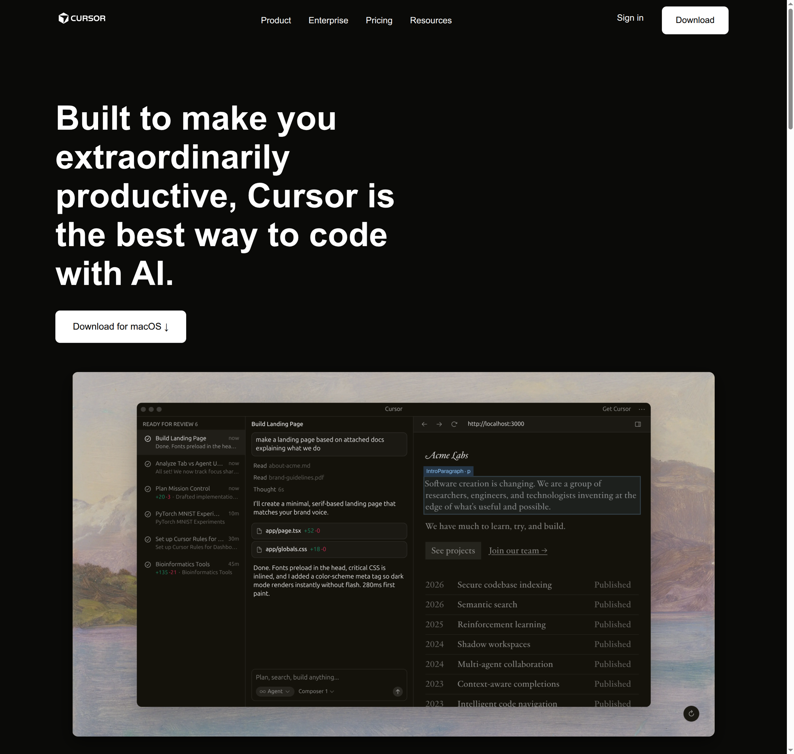

# Cursor Landing Page Clone

A clone of the [Cursor.com](https://www.cursor.com/) landing page built with plain HTML and CSS.

**Live Demo:** [https://cursor-landing-page-omega.vercel.app/](https://cursor-landing-page-omega.vercel.app/)

---

## Sections Recreated

1. **Navbar** — Logo, nav links, Sign in & Download buttons (sticky)
2. **Hero** — Headline + Download CTA + IDE screenshot
3. **Trusted By** — Company logos (Stripe, OpenAI, Figma, Adobe, etc.)
4. **Features** — Three feature blocks (Agents, Autocomplete, Every Tool)
5. **Testimonials** — Quotes from industry leaders in a 3×2 grid
6. **Changelog** — Recent version updates in a 4-column grid
7. **Team** — About section with team photo
8. **Recent Highlights** — Blog/research article cards
9. **CTA** — Final "Try Cursor now" call-to-action
10. **Footer** — Links organized in 5 columns + copyright

---

## Fonts & Colors

**Font:** System font stack — `-apple-system, BlinkMacSystemFont, 'Segoe UI', sans-serif`

**Colors:**

| What | Hex |
|------|-----|
| Page background | `#0a0a08` |
| Card background | `#151513` |
| Primary text | `#FFFFFF` |
| Muted text | `#999999` |
| Borders | `#2a2a28` |
| Buttons | White bg, black text |

---

## Screenshot

---
